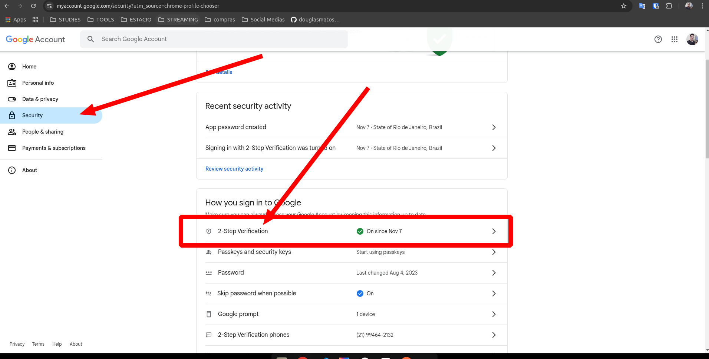
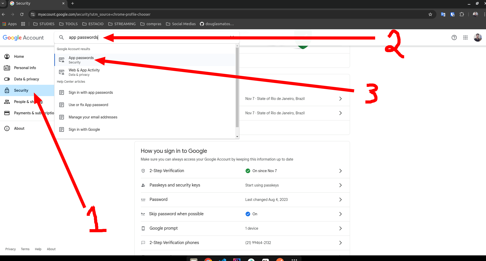
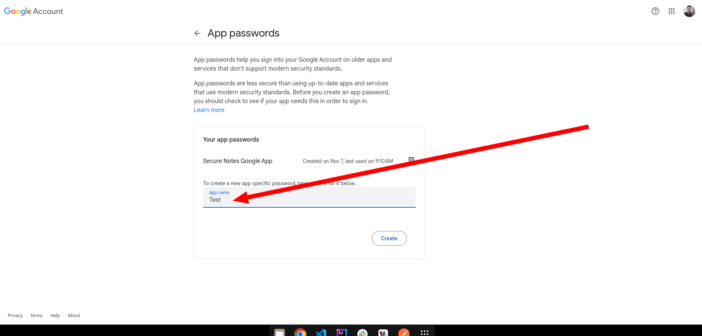
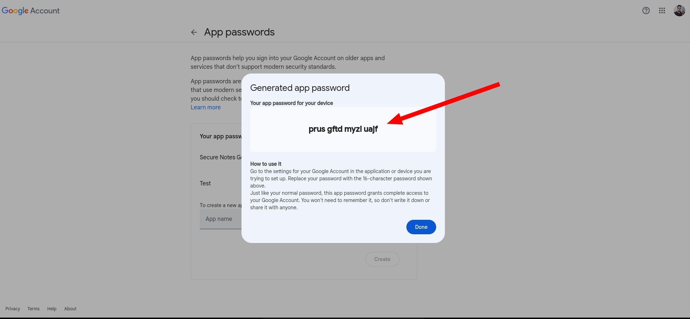

# E-Mail Configuration

This project uses Google SMTP Server for send e-mails,
you need to configure your e-mail and password in the application.properties file.

```properties
spring.mail.username=${SECURE_NOTES_EMAIL_URL}
spring.mail.password=${SECURE_NOTES_EMAIL_PASSWORD}
```

But the password NOT is your e-mail password, you need to create an app password in your Google Account.

### Create App Password
1. Go to Google Account Management
2. Click on Security
3. Enable 2-Step Verification

4. In the search bar, type "App Passwords"

5. Define the app name

6. Copy the generated password and paste WITHOUT SPACES in the application.properties file


