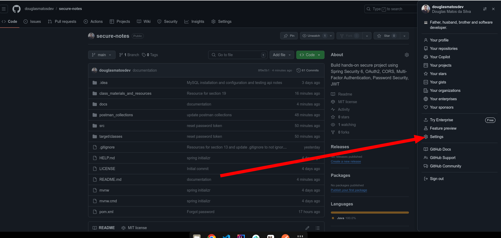
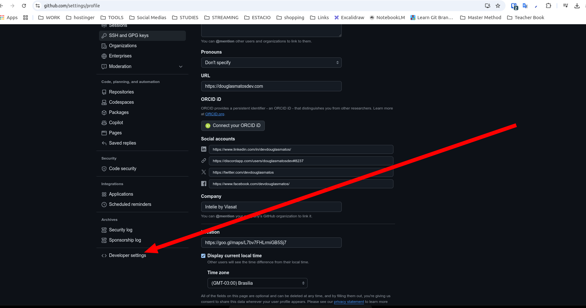
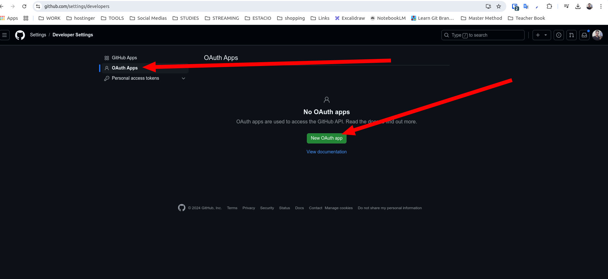
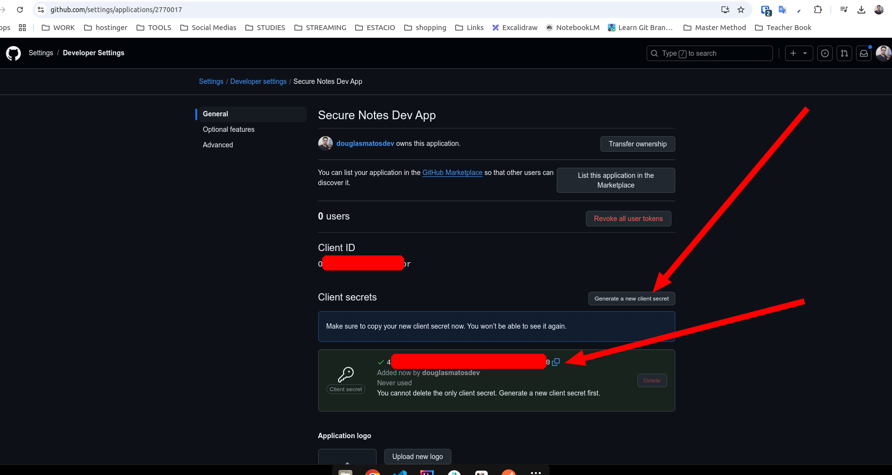

# GitHub Authentication

1. Go to your GitHub account
2. Go to `Settings`

3. Go to `Developer settings`

4. Go to `OAuth Apps` and click on `New OAuth App`

5. Fill the form fields and click on `Register application`

6. Copy the `Client ID` and `Client Secret` and paste in your `application.properties` file

```properties
# GitHub OAuth2 configuration
spring.security.oauth2.client.registration.github.client-id=${GITHUB_CLIENT_ID}
spring.security.oauth2.client.registration.github.client-secret=${GITHUB_CLIENT_SECRET}
spring.security.oauth2.client.registration.github.scope=read:user,user:email
``

