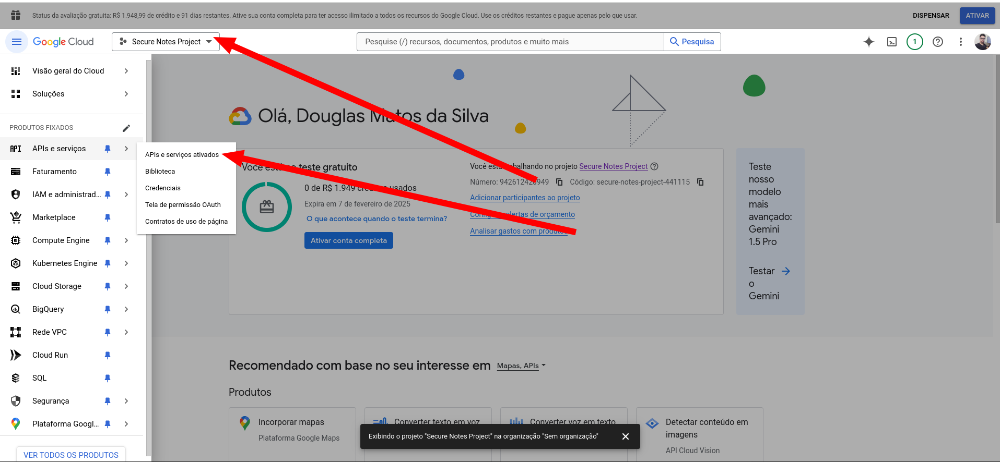

# Google Authentication
1. Search for Google Cloud Console

2. In the Google Cloud Console, click create project

3. Go to `APIs & Services`

4. Go to `credentials` and select OAuth client ID

5. Go to `OAuth consent screen`

6. Select `External` and click create

7. Fill in the necessary details and click save

8. Go to `OAuth consent screen` and click on `Add Scopes`

9. Create user tests

10. Configure OAuth App

11. Fill in the necessary details and click save

12. Save the client ID and client secret

13. Put the client ID and client secret in the `application.properties` file
```properties
# Google OAuth2 configuration
spring.security.oauth2.client.registration.google.client-id=${GOOGLE_CLIENT_ID}
spring.security.oauth2.client.registration.google.client-secret=${GOOGLE_CLIENT_SECRET}
```