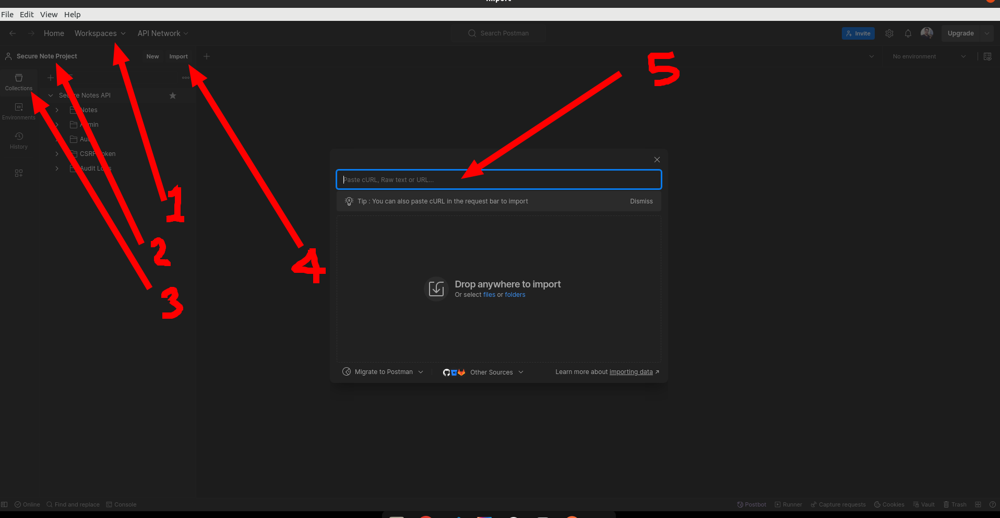

# Postman Collection
1. Create or make login in postman account
2. Create a workspace
3. Create a project
4. In the project, click on `Collections` and click on `Import`
5. Copy JSON from [Postman Collection](../postman_collections/Secure Notes API.postman_collection_postman_version_2.json)
6. Paste JSON and click on `Import`

Collection for version 2 and 2.1
- [Collection version 2](../postman_collections/Secure Notes API.postman_collection_postman_version_2.json)
- [Collection version 2.1](../postman_collections/Secure Notes API.postman_collection_postman_version_2.1.json)

