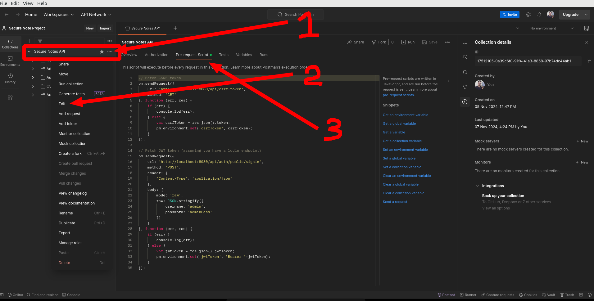

# Postman Pre-Request Script

This script is used to generate a JWT token and CSRF token for the user. The token is then used to authenticate the user for the API requests.

## How to use
1. Open Postman
2. Click on the three dots on the right corner of the collection
3. Click on `Edit`
4. Click on `Pre-request Scripts`


Code example:
```javascript
// Fetch CSRF token
pm.sendRequest({
    url: 'http://localhost:8080/api/csrf-token',
    method: 'GET'
}, function (err, res) {
    if (err) {
        console.log(err);
    } else {
        var csrfToken = res.json().token;
        pm.environment.set('csrfToken', csrfToken);
    }
});

// Fetch JWT token (assuming you have a login endpoint)
pm.sendRequest({
    url: 'http://localhost:8080/api/auth/public/signin',
    method: 'POST',
    header: {
        'Content-Type': 'application/json'
    },
    body: {
        mode: 'raw',
        raw: JSON.stringify({
            username: 'admin',
            password: 'adminPass'
        })
    }
}, function (err, res) {
    if (err) {
        console.log(err);
    } else {
        var jwtToken = res.json().jwtToken;
        pm.environment.set('jwtToken', "Bearer "+jwtToken);
    }
});
```